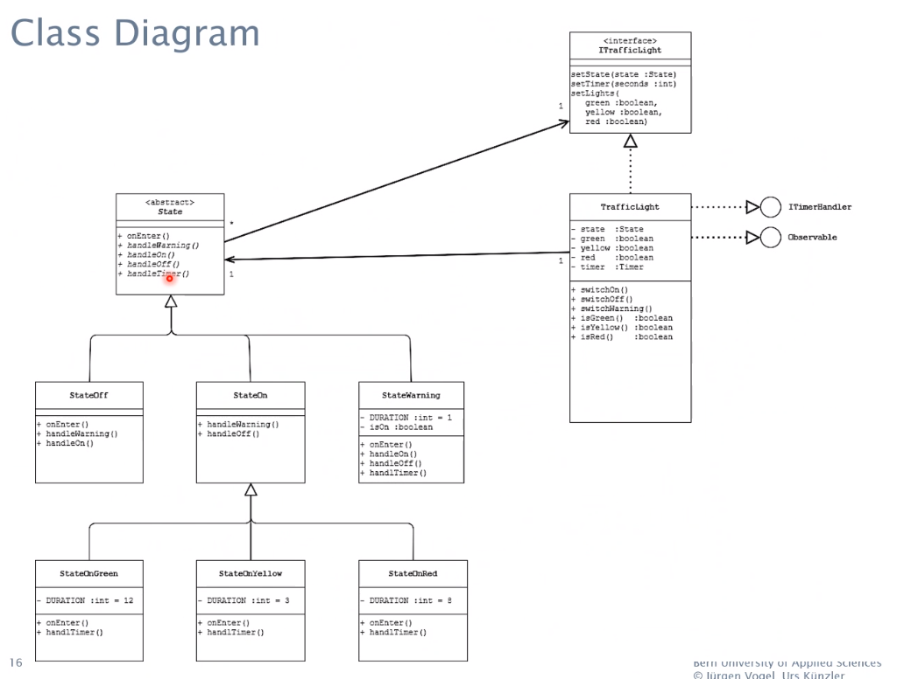
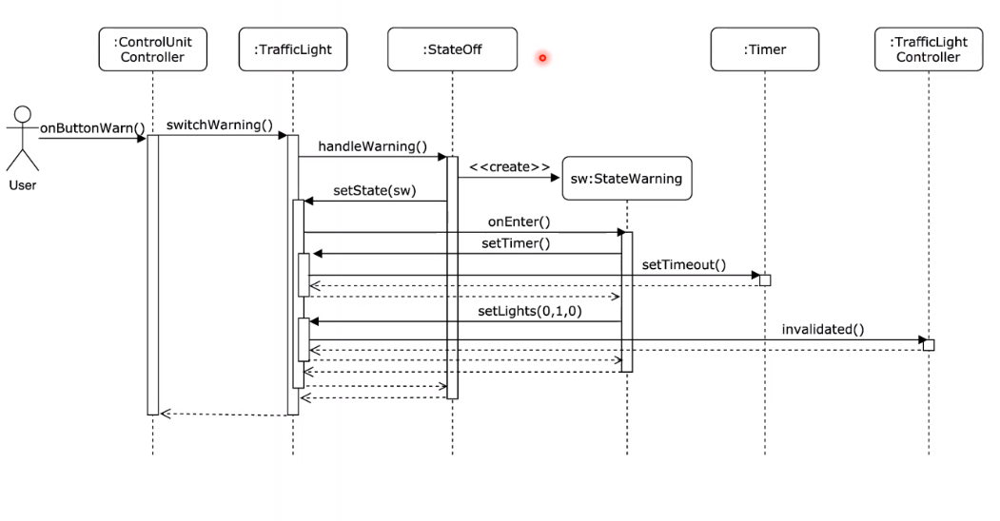

# traffic-light

## Run

```
https://github.com/herzo1/traffic-light.git
cd traffic-light
mvn clean compile javafx:run
```

## Description
Implementation of the exercise **traffic-light** from the module software engineering.

Be aware there could be a difference between the diagrams and the actual implementation.
There were some errors in the given diagrams.

Class diagram: 


Sequence diagram:


